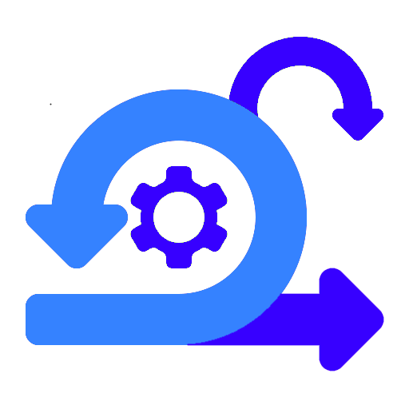
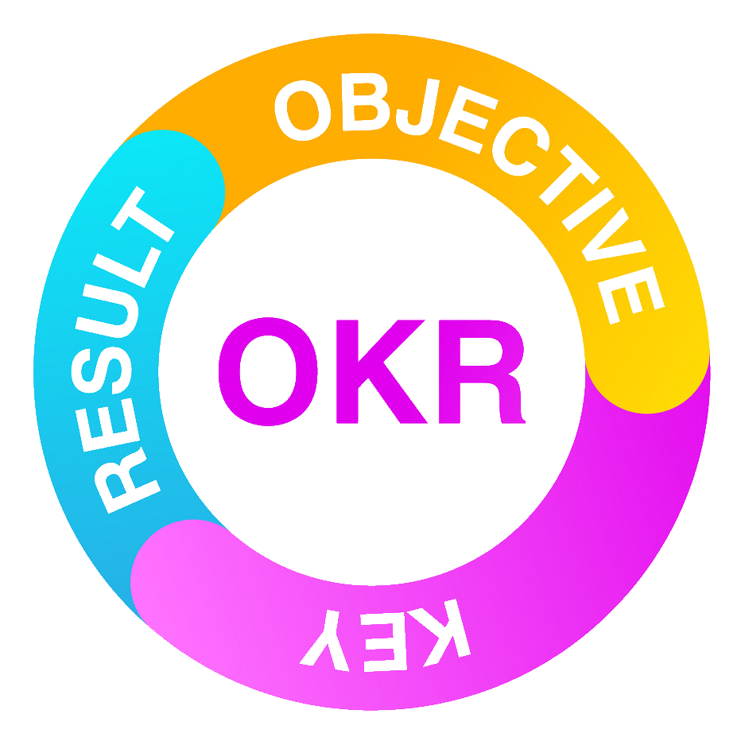

# 👋 Hi, I’m Marius

## About Me

👨‍💼 DevOps Engineer at DNB in Norway
🌱 I'm passionate about simplifying the journey to Azure for application teams by establishing and enhancing platform services on Azure and providing a better developer experience.
👷 Previously, I worked as a delivery consultant at Microsoft where I built Azure Platforms and set up DevOps platform teams for several large organizations in the EMEA region.

## 📢 Achievements

- Founding team member and maintainer of CARML (aka. Azure Resource Modules). Now a contributor, as I am no longer with Microsoft. [Azure/ResourceModules: This repository includes a CI platform for and collection of mature and curated Bicep modules. The platform supports both ARM and Bicep and can be leveraged using GitHub actions as well as Azure DevOps pipelines.](https://github.com/Azure/ResourceModules)
- Key contributor to the [Platform Automation and DevOps design ares in Microsoft Cloud Adoption Framework](https://learn.microsoft.com/en-us/azure/cloud-adoption-framework/ready/landing-zone/design-area/platform-automation-devops)

<!--
Gravatar.org

https://github.com/Gordonby

-->

## 🔭 I’m currently working on

-  [PowerShell module framework via GitHub actions](https://www.github.com/PSModule/)
  - Streamline module development on GitHub, using Github Actions and Pages.
-  [PowerShell module for GitHub](https://www.github.com/PSModule/GitHub)
-  [PowerShell module for AzureDevOps](https://www.github.com/PSModule/AzureDevOps)
- Other smaller PowerShell modules:
  - [PATH](https://www.github.com/PSModule/PATH)
  - [Fonts](https://www.github.com/PSModule/Fonts)
  - [NerdFonts](https://www.github.com/PSModule/NerdFonts)
  - [Utilities](https://www.github.com/PSModule/Utilities)
  - [PublicIP](https://www.github.com/PSModule/PublicIP)

## 🌱 I’m currently learning

- Advanced PowerShell module development
- Azure Functions
- Azure DevOps authentication

## ⚙️ I have experience on

Establishing or enhancing product teams to develop a platform on Azure.
- Management and Governance (i.e. policy)
- Identity and Access Management (AAD)
- Network and Security
- Platform automation
- Automated subscription provisioning (CSP, EA and MCA)

### 🛠️ Tools

### 📝 Languages

### 📃 Non-technical

- Cloud Adoption Framework
- Enterprise-Scale (Azure Landing Zone)
- Getting Things Done

## 📫 You can reach me here

