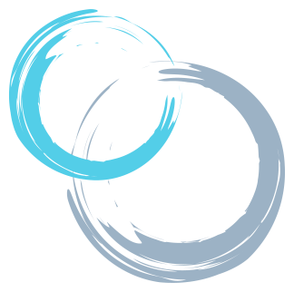

# 👋 Hi, I’m Marius

I am a Senior Consultant at Microsoft, where I help some of the biggest organizations and partners in the Nordics
to establish or enhance a platform in Azure.

## 🔭 I’m currently working on

- [Azure/ResourceModules](https://github.com/Azure/ResourceModules) - a library of bicep modules
- [AzActions](https://github.com/AzActions) - a set of github actions to simplify IaC deployment

## 🌱 I’m currently learning

- Scrum - Product Owner
- Advanced PowerShell module development

## ⚙️ I have experience on

Establishing or enhancing product teams to develop a platform on Azure.
- Management and Governance (i.e. policy)
- Identity and Access Management (AAD)
- Network and Security
- Platform automation
- Automated subscription provisioning (CSP, EA and MCA)

### 🛠️ Tools

### 📝 Languages

### 📃 Non-technical

- OKRs
- Cloud Adoption Framework
- Enterprise-Scale (Azure Landing Zone)
- Getting Things Done

## 📫 You can reach me here

## **📊 Stats**

